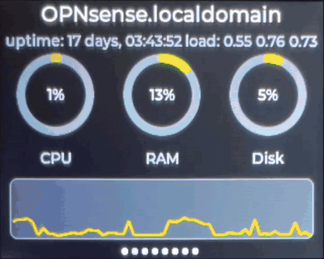

# CYD Dashboard for OPNsense

Live [OPNsense](https://opnsense.org/) firewall stats on a "Cheap Yellow Display" -- the
inexpensive ESP32-2432S028R touchscreen board (320x240, ILI9341, resistive touch).



*Sped up 4x -- [full-speed video](assets/Dashboard_Video.mp4) (40s).*

Eight pages covering system health, traffic, firewall blocks, connected clients and more, tapped
through on the touchscreen. Nothing is compiled in: Wi-Fi and settings are configured on the
device and from a small web UI it serves on your network.

## Getting started

Two halves, and the order matters:

1. **[Set up the middleware](middleware/)** on an always-on machine with Docker. It needs an
   OPNsense API key. If you run Portainer, there is a
   [copy-paste stack](middleware/README.md#option-a-portainer-copy-and-paste) -- paste it, edit
   three values, deploy.
2. **[Flash the display](firmware/)** and point it at the middleware's address. Prebuilt binaries
   are attached to every [release](https://github.com/HenrysCat/cyd-dashboard-for-opnsense/releases/latest),
   so PlatformIO is only needed if you want to change the code.

No credentials are compiled into the firmware -- Wi-Fi and the middleware address are entered on
the device itself on first boot.

## How it fits together

```
OPNsense  <--HTTPS/API-->  middleware (Docker)  <--HTTP/JSON-->  ESP32 (LVGL firmware)
```

- **[`middleware/`](middleware/)** — a small FastAPI service that polls the OPNsense REST API,
  computes the things a microcontroller shouldn't (traffic rates, firewall block rates,
  device names), and
  serves one compact JSON blob. Ships as a Docker image; the repo's `docker-compose.yml` runs
  directly with `docker compose` or deploys as a Portainer "Repository" stack.
- **[`firmware/`](firmware/)** — a PlatformIO + LVGL + TFT_eSPI project that polls the middleware
  and renders the pages.

Keeping the heavy lifting off the ESP32 is deliberate: it has ~320KB of RAM and no PSRAM, so TLS to
OPNsense, large JSON payloads (the firewall log endpoint alone defaults to ~700KB) and rate
calculations all happen in the middleware.

## Pages

| Page | Shows |
|---|---|
| Overview | Hostname, uptime, load, CPU/RAM/disk gauges, CPU trend, update badge |
| Traffic | WAN in/out with trend chart, plus LAN throughput |
| CPU & Thermal | CPU %, load, per-core and ACPI zone temperatures, temperature trend |
| Interfaces & Gateways | Interfaces with device names, gateways, live WAN rates |
| Services | Every service, colour-coded running/stopped, with a running count |
| Firewall | Blocks/min, top source, and the most recent log entries with rule labels |
| Clients | DHCP/ARP devices, online/offline, identified by hostname or NIC vendor |
| CrowdSec | Ban decisions and recent alerts with country and AS *(optional — see below)* |
| System Info | Device IP, Wi-Fi, heap, uptime, build — **short-press the BOOT button** |

**Optional pages.** CrowdSec is an OPNsense plugin. If it isn't installed its endpoints return 404;
the middleware detects that once, stops polling it, and the firmware leaves the page out of the
rotation entirely rather than showing an empty screen. The dot indicator shrinks to match.

## Configuring it

- **First boot** raises a Wi-Fi captive portal to set Wi-Fi and the middleware address — there are
  no compile-time secrets.
- **Settings web UI** on the device (`http://<device-ip>/` or `http://cyd-dash.local/`) covers
  backlight, panel orientation/colour corrections, page auto-cycling, and firmware updates over
  Wi-Fi. Everything applies immediately.
- **Short-press BOOT** for System Info; **hold BOOT 10s** for a network factory reset.

## Robustness

Built to sit on a wall unattended:

- A red dot appears if Wi-Fi drops, data goes stale, or nothing has arrived — so on-screen values
  are never silently out of date.
- Wi-Fi reconnects on its own after an AP reboot or outage.
- A task watchdog reboots the device if the main loop stalls.
- The middleware has a Docker healthcheck, so a wedged (not merely crashed) container is restarted.
- Failed OPNsense polls keep the last known good values rather than blanking the display.

See [`middleware/README.md`](middleware/README.md) and [`firmware/README.md`](firmware/README.md)
for setup of each half.

## Licence

MIT -- see [`LICENSE`](LICENSE).

## Trademarks

OPNsense® is a registered trademark of Deciso B.V. CrowdSec is a trademark of CrowdSec SAS. This is an unofficial, independent project and is not affiliated with, endorsed by, or sponsored by Deciso B.V. or CrowdSec SAS.
